# 前言
相信大部分人都做过UI渲染优化，其重点也就是合批。但是在当前cocos使用节点树深度遍历的方式中，想要把相同类型的组件放在一起，势必会修改节点树，很可能破坏掉优雅合理的节点组织结构；还有可能因为节点树的改动，需要添加一些冗余糟糕的代码。
最近刚好有时间，逛论坛的时候看到有同学提这类问题，各位大哥也给出了解决方案，就是在渲染的时候给节点重新排序。于是心血来潮去看了下3.6.3的源码，好像要实现其实挺简单的。
# 原理
为需要排序的UI渲染器(Sprite或者Label等)设置排序优先级； 在UI渲染遍历节点树阶段，不立即执行各种UI渲染器，而是把UI渲染器缓存起来；在UI渲染遍历完节点树后，对UI渲染器缓存通过排序优先级进行排序后执行。然而，遮罩会打断这一过程，所以如果项目中大量使用了遮罩，优化效果可能会不太明显。
# 效果对比
在ScrollView下生成200个项目测试对比。

测试设备：HUAWEI P30 Pro

项目预制体结构：
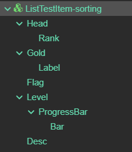 

* ## 测试平台：web-mobile

  * `未使用UI渲染优化`：
  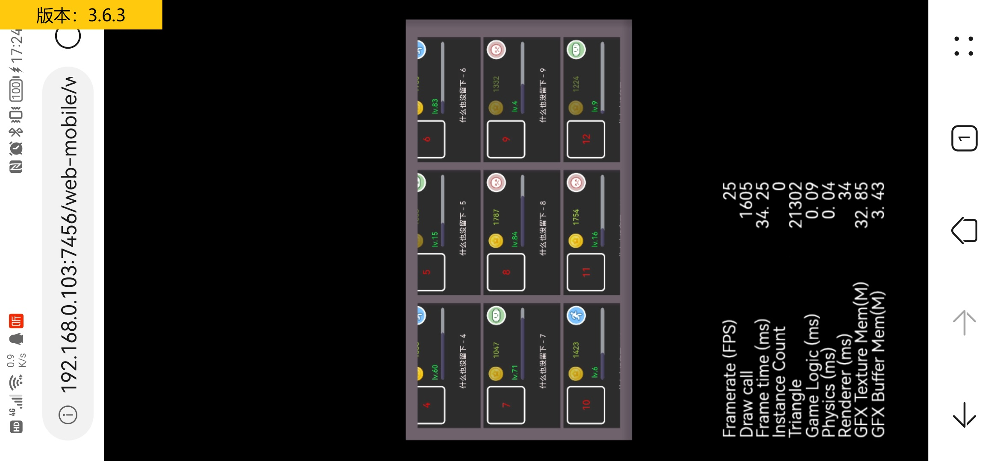 
  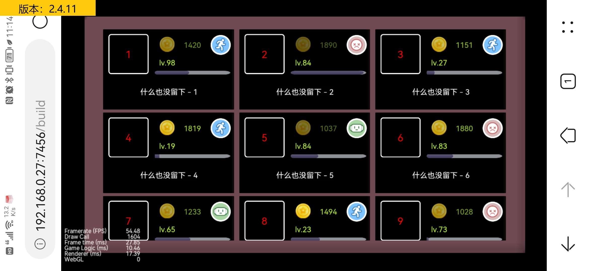 
  * `使用UI渲染优化`：
  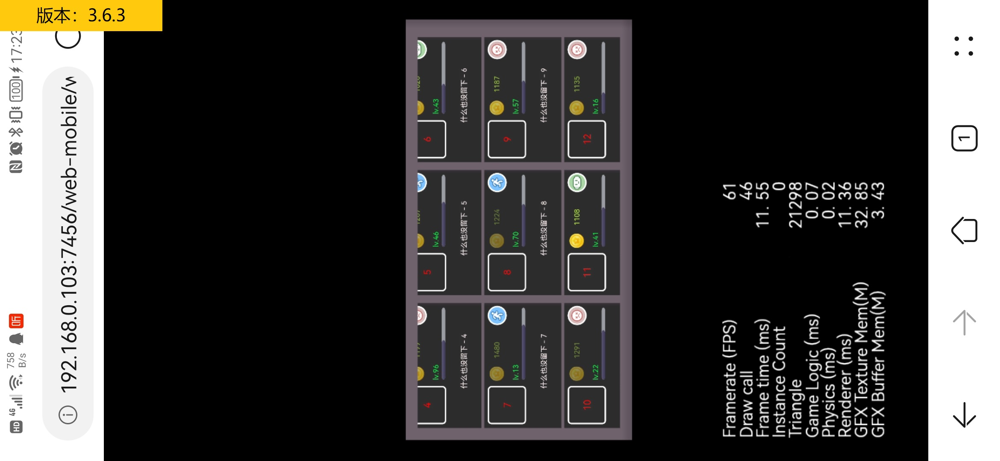 
  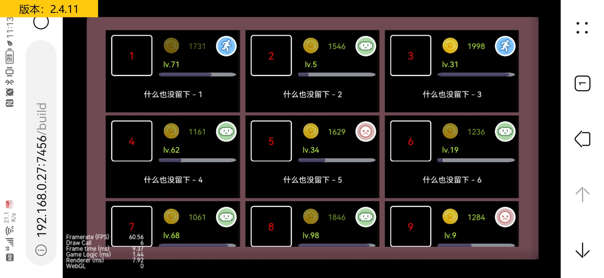 

* ## 测试平台：android

  * `未使用UI渲染优化`：
  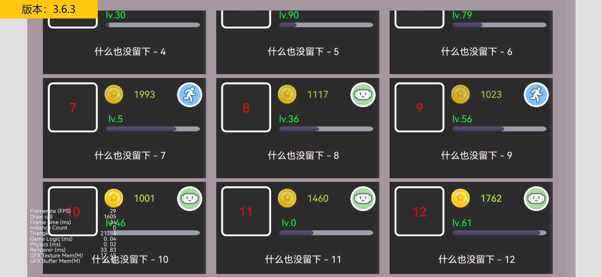 
  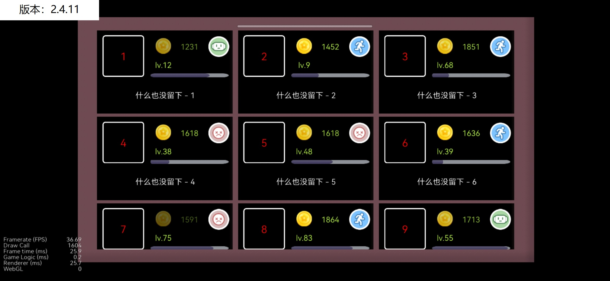 
  * `使用UI渲染优化`：
  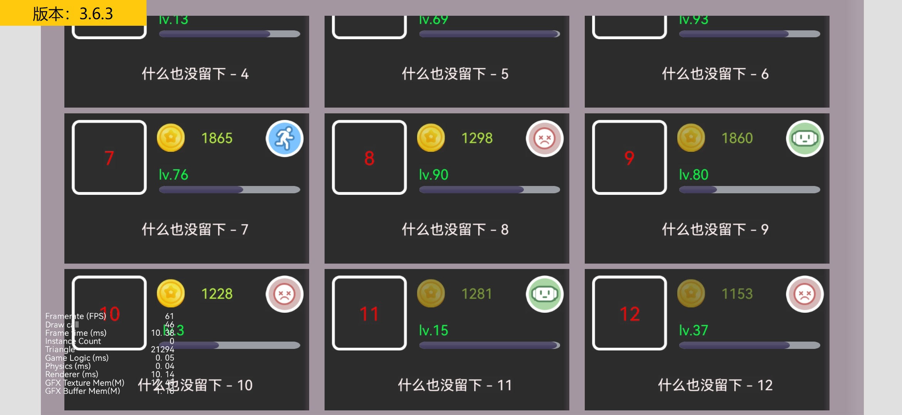 
  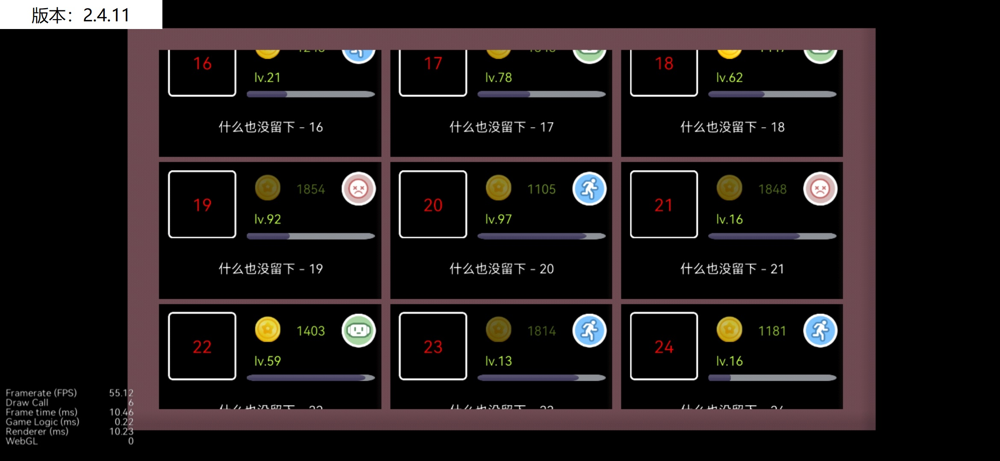 

项目越多，差距越明显。

# 使用方式
看到标题的时候，相信使用过Unity的同学就差不多知道使用方式了。API设计其实就是照搬的Unity的SortingGroup。使用步骤如下；
1. 导入扩展包`lcc-ui-sorting-group`到项目assets目录内

2. 如果是原生项目，需要进行以下步骤；
   * 3.x项目:
     * 检查Native扩展包`lcc-ui-sorting-group-native`的`readme.txt`文件，以确保匹配creator版本
     * 构建原生项目，会在根目录生成`native`目录
     * 导入Native扩展包到`native/engine`目录下
     * 复制`lcc-ui-sorting-group-native/backup/CMakeLists.txt`文件到引擎Native目录替换。主要是引擎的`CMakeLists.txt`文件没有提供自定义接口。扩展包的`CMakeLists.txt`只是添加了部分自定义接口，在删除此插件的时候可以选择保留，不会有其他影响。
     * 修改`native/engine/common/CMakeLists.txt`文件，在代码`include(${COCOS_X_PATH}/CMakeLists.txt)`上面添加插件配置，具体如下;
        ``` 
        ...

        # 插件配置 引入lcc-ui-sorting-group native部分
        include(${CMAKE_CURRENT_LIST_DIR}/../lcc-ui-sorting-group-native/CMakeLists.txt)

        include(${COCOS_X_PATH}/CMakeLists.txt) #在这一行上面插入插件配置

        ...
        ```
   * 2.x项目:
     * 检查Native扩展包`lcc-ui-sorting-group-native`的`readme.txt`文件，以确保匹配creator版本
     * 构建原生项目，需要选择模板为default, 会在根目录生成`build/jsb-default`目录
     * 复制Native扩展包`lcc-ui-sorting-group-native/cocos2d-x`下的所有文件到`build/jsb-default/frameworks/cocos2d-x`目录以覆盖引擎原始文件

3. 定义排序层枚举，扩展包目录如下 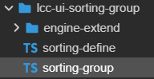 ，打开sorting-define.ts文件，添加或修改SortingLayer枚举
```
/**
 * 排序层级
 */
export enum SortingLayer {
    
    //-- 自定义，在此之上，小于 DEFAULT 的层级

    /** 
     * 默认层级，在没有应用排序的UI渲染上的默认层级
     */
    DEFAULT = 0,

    //-- 自定义，在此之下，大于 DEFAULT 的层级

    // 测试定义，可以直接移除
    TEST_LIST_ITEM = 1,
}

/**
 * 在层级中最大排序值
 */
export const ORDER_IN_LAYER_MAX = 100000;
```
4. 在需要排序的UI节点上，添加`SortingGroup`组件，并设置排序层和排序值，其配置会应用于当前节点和子孙节点上的UI渲染器； 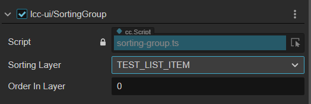 

    UI渲染器的优先级以当前节点或者最近的祖先节点上的`SortingGroup`组件配置为准，如果没有则默认为`0`。
    并且优化操作只针对排序节点和其子节点，其他节点仍然使用节点树遍历。

    和Unity不同的是`Order In Layer`不必是整数，这里可以使用小数。
不同`Sorting Layer`的情况下，`Sorting Layer`枚举越小越先渲染；相同`Sorting Layer`的情况下，`Order In Layer`的值越小越先渲染。

# 注意
1. 该扩展包对引擎进行过小改，如果想移除这个功能，在删除扩展包目录后需要重启编辑器。
2. 当前项目包含了2.4.11和3.6.3版本demo
